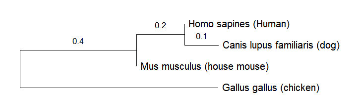

# 🧬 COL1A1 Phylogenetic Analysis Using MEGA12

## 📌 Overview

This project demonstrates a phylogenetic analysis of the **COL1A1 (Collagen Type I Alpha 1 Chain)** gene using DNA sequences obtained from the **NCBI Gene database**.

Four COL1A1 sequences representing different species were analyzed:

- Homo sapiens (Human)
- Mus musculus (House mouse)
- Gallus gallus (Chicken)
- Canis lupus familiaris (Dog)

Multiple sequence alignment was performed using **MUSCLE in MEGA12**, followed by phylogenetic tree construction using the **Neighbor-Joining (NJ)** method.

---

## 🎯 Objective

The objective of this analysis was to:

1. Retrieve COL1A1 DNA sequences from NCBI.
2. Prepare FASTA sequences for phylogenetic analysis.
3. Perform multiple sequence alignment using MUSCLE.
4. Export the aligned sequences in MEGA format.
5. Construct a Neighbor-Joining phylogenetic tree.
6. Visualize the evolutionary relationships among the selected species.

---

## 🧬 Gene Information

The analysis was performed using the **COL1A1** gene.

| Species | Gene | NCBI Gene ID |
|---|---|---:|
| Homo sapiens | COL1A1 | 1277 |
| Mus musculus | Col1a1 | 12842 |
| Gallus gallus | COL1A1 | 395532 |
| Canis lupus familiaris | COL1A1 | 403651 |

The sequences were retrieved from the NCBI Gene database.

---

## 🛠️ Software

### MEGA12

- Version: **MEGA12 / 12.1**
- Platform: Windows 64-bit
- Website: https://megasoftware.net/

### Database

- **NCBI Gene**
- Website: https://www.ncbi.nlm.nih.gov/

---

## 🔬 Methodology

### Step 1 — Sequence Retrieval

The COL1A1 gene was searched in the NCBI Gene database.

Four DNA sequences were selected:

1. Homo sapiens
2. Mus musculus
3. Gallus gallus
4. Canis lupus familiaris

The sequences were obtained in FASTA format.

---

### Step 2 — Sequence Preparation

The FASTA sequences were collected and imported into MEGA12.

FASTA format was used, where each sequence begins with the `>` identifier line.

---

### Step 3 — Multiple Sequence Alignment

The sequences were imported into MEGA12 using the alignment workflow.

The following steps were performed:

```text
Alignment
    ↓
Align
    ↓
Create a New Alignment
    ↓
Add the four sequences
    ↓
MUSCLE alignment

### Step 4 — Export Alignment

After completing the multiple sequence alignment, the aligned sequences were exported in **MEGA format**.

The alignment file is included in this repository:

`alignment/COL1A1_Genes.meg`

---
```
### Step 5 — Phylogenetic Tree Construction

A phylogenetic tree was constructed using the:

**Neighbor-Joining (NJ) method**

The evolutionary distances were calculated using the:

**Maximum Composite Likelihood method**

The analysis was performed using nucleotide sequences.

The final analyzed dataset contained **134 nucleotide positions**.

---

## 🌳 Phylogenetic Tree

The resulting Neighbor-Joining tree is shown below.



### Tree Interpretation

The reconstructed tree represents the relationships among the four selected COL1A1 sequences.

In this analysis:

- **Homo sapiens** and **Canis lupus familiaris** form a sister group.
- **Mus musculus** branches separately from the human–dog group.
- **Gallus gallus** forms the more distant branch among the four sampled sequences.

These observations describe the topology obtained from the selected sequences and the specific phylogenetic method used in this project.

The tree is drawn according to the evolutionary distances calculated during the analysis.

**Scale bar:** 0.10 substitutions per site.

---

## 📊 Analysis Summary

| Parameter | Details |
|---|---|
| Gene | COL1A1 |
| Sequence type | DNA |
| Number of species | 4 |
| Alignment method | MUSCLE |
| Phylogenetic method | Neighbor-Joining |
| Distance method | Maximum Composite Likelihood |
| Analyzed positions | 134 |
| Software | MEGA12 v12.1 |
| Sequence database | NCBI Gene |

---

## 📁 Repository Structure

```text
COL1A1-Phylogenetic-Analysis-MEGA12/
│
├── data/
│   └── COL1A1_sequences.fasta
│
├── alignment/
│   └── COL1A1_Genes.meg
│
├── tree/
│   └── COL1A1_NJ_tree.png
│
├── results/
│   └── phylogenetic_analysis_notes.md
│
└── README.md

---
```
## 🔗 Resources

- [NCBI Gene](https://www.ncbi.nlm.nih.gov/)
- [MEGA Software](https://megasoftware.net/)

---

## 👩‍💻 Author

**Sahana**

M.Tech Computational Biology  
Bioinformatics | Computational Biology | Genomics | NGS
